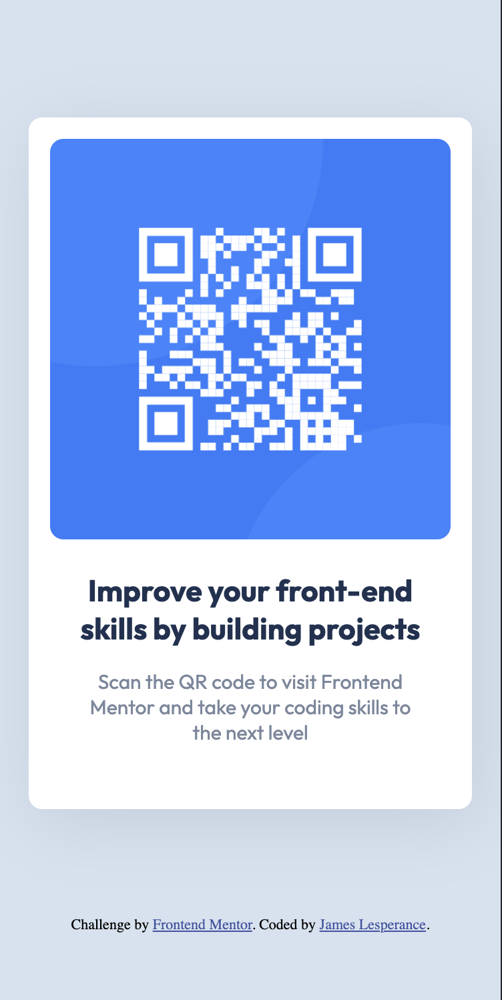

# Frontend Mentor - QR code component solution

This is a solution to the [QR code component challenge on Frontend Mentor](https://www.frontendmentor.io/challenges/qr-code-component-iux_sIO_H). Frontend Mentor challenges help you improve your coding skills by building realistic projects. 

## Table of contents

- [Overview](#overview)
  - [Screenshot](#screenshot)
  - [Links](#links)
- [My process](#my-process)
  - [Built with](#built-with)
  - [What I learned](#what-i-learned)
  - [Continued development](#continued-development)
  - [Useful resources](#useful-resources)
- [Author](#author)
- [Acknowledgments](#acknowledgments)

**Note: Delete this note and update the table of contents based on what sections you keep.**

## Overview

In this challenge, I built a QR component using HTML
and CSS that would link to Frontend Mentors.  We were given the styles and images, which would be used to recreate the design.  This was an effective practice for creating a simple tool using web dev technologies.

### Screenshot

### Links

- Solution URL: [Add solution URL here](https://github.com/tunajim/QR-code-challenge)
- Live Site URL: [Add live site URL here](https://tunajim.github.io/QR-code-challenge/)

## My process

### Built with

- Semantic HTML5 markup
- CSS custom properties
- Flexbox
- Mobile-first workflow

### What I learned

This was a fun review to test my HTML and CSS knowledge, I learned that I have a much easier time putting together a component when the design is already complete.  I tend to spend much of my time thinking about the design rather than actually coding.  Fortunately, I find that the coding is what I truly enjoy and what comes naturally to me.

### Continued development

I hope to continue to improve my overall skills with regards to HTML, CSS, and JavaScript.  I want to ensure my proficiency and master the basics of these languages.  I will continue building projects and refining my skills.

### Useful resources

- [Example resource 1](https://www.theodinproject.com) - This particular curriculum is how I have self-taught web development, it teaches you what you need to understand in order to build full-stack applications and it is a very helpful resource.
- [Example resource 2](https://www.vancouver.wsu.edu/) - My passion for web development has landed me back in college, where I hope to continue pursuing this field and work towards finishing my degree in Digital Technologies and Culture, with a Computer Science Minor.  Washington State University, Vancouver has prepared me to be successful in fast-paced, high-skill environments.

## Author

- Website - [James Lesperance](https://dtc-wsuv.org/jlesperance23/portfolio/)
- Frontend Mentor - [@tunajim](https://www.frontendmentor.io/profile/tunajim)

## Acknowledgments

A big thank you to the frontend mentor organization that put together the design and assets for this challenge
